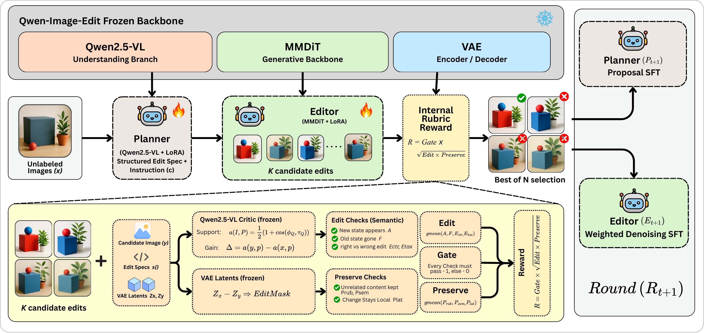

# Rubric-CEPR: Self-Evolving Image Editing via Reward-Verified Self-Distillation

Rubric-CEPR improves a pretrained image editor from its own verified edits, with
no human-edited targets and no external reward model during training. A Planner
specifies an edit, an Editor generates candidates, and a frozen Critic checks the
requested change and preservation of the source. Only candidates that pass every
applicable gate become training targets for a lightweight adapter, which is then
evaluated in the standard single-shot setting.

The Critic scores candidates with a rubric-augmented **Contrastive
Edit-Preservation Reward (CEPR)**. CEPR contrasts support for the requested edit
with incorrect alternative instructions and rewards preservation of unrelated
content; the rubric adds explicit checks for required states, removal of forbidden
old states, and preservation constraints. A candidate's reward is
`R = G * sqrt(E * P)`, and it is zero whenever a gate fails.

[Project page](https://riteshthawkar.github.io/Rubric-CEPR/) ·
[Method](docs/METHOD.md) · [Training](docs/TRAINING.md) ·
[Evaluation](docs/EVALUATION.md) · [Results](docs/RESULTS.md)

## Architecture



A frozen Qwen-Image-Edit backbone provides understanding features and VAE latents
for the internal Critic. The Planner specifies edits, the Editor samples
candidates, and gate-passing candidates are selected for Planner and Editor
updates across rounds.

## Overview

| Component | Role | Implementation |
|---|---|---|
| Planner | Propose an instruction and a structured edit specification | `self_evolve/edit_schema.py`, `self_evolve/backends.py` |
| Editor | Generate candidate edits and learn from accepted targets | `self_evolve/loop.py`, `train/` |
| Critic | Check semantics, preservation, validity and edit-specific rubric items | `self_evolve/backends.py` |

Implementation paths above are relative to `src/qwen_edit_project/`.
The Critic uses the editor's own pretrained components and receives no gradients.
External benchmark judges are used only during evaluation.

This branch (`main`) implements the internal workflow only. The earlier
detector-assisted extraction recipe (GroundingDINO object naming, a fixed
64-pair set) and its recorded evaluations are kept on the
[`groundingdino-extraction`](https://github.com/riteshthawkar/Rubric-CEPR/tree/groundingdino-extraction)
branch as separate evidence.

## Results

Scores reported in the paper. Base is Qwen-Image-Edit-2509 under the same
protocol; the adapted ImgEdit score is the mean over three training seeds
(4.58, 4.60, 4.62). Δ Improvement is the relative improvement over the base,
`100 * (adapted - base) / base`.

| Benchmark | Qwen-Image-Edit-2509 | Rubric-CEPR | Δ Improvement |
|---|---:|---:|---:|
| ImgEdit (overall, 0–5) | 4.36 | **4.60** ± 0.02 SD | +5.5% |
| ImgEdit, Extract family | 3.41 | **4.26** | +24.9% |
| GEdit-Bench (overall, 0–10) | 7.39 | **8.31** | +12.4% |
| Complex-Edit (overall, 0–10) | 8.77 | **8.97** | +2.3% |

The same procedure applied to Step1X-Edit, using its own VLM and VAE, improves the
overall GEdit-Bench score from 6.69 to 7.24 (+8.2%) and the overall ImgEdit score
from 3.86 to 4.16 (+7.8%).

**Availability.** This repository contains the implementation and the matched
evaluation protocols. Checkpoints, training receipts and raw benchmark outputs
are separate assets. [Result provenance and artifact availability](docs/PAPER_PROVENANCE.md)
describe the records associated with each reported result. New runs should record
the actual adapter hash and evaluation receipts before being compared with the table above.
Per-family and per-metric tables are in [docs/RESULTS.md](docs/RESULTS.md).

## Repository layout

```text
src/
  rubric_cepr/                 # Public CLI and CPU checks
  qwen_edit_project/
    self_evolve/               # Planner, Editor, Critic and round orchestration
    train/                     # Editor and Planner LoRA training
    eval/                      # Benchmark exports, scoring and result parsing
    utils/                     # Model loading and configuration helpers
configs/
  self_evolve/                 # Reference framework configuration
  train/                       # Editor LoRA training configuration
  eval/                        # Matched benchmark protocols
scripts/                       # CLI launcher, benchmark setup and Slurm examples
reproducibility/               # Framework identity and result availability records
docs/                          # Method, training, evaluation and results
examples/                      # Example unlabeled source manifest
tests/                         # CPU tests for inputs, commands and boundaries
assets/                        # Framework figure from the paper
```

## Setup

Use a source checkout with Python 3.11 or newer. The CLI reads the configurations
beside the source, so install it in editable mode:

```bash
git clone https://github.com/riteshthawkar/Rubric-CEPR.git
cd Rubric-CEPR
python -m pip install -e '.[dev]'
rubric-cepr check
python -m pytest -q
```

For model execution, use the versions in
[requirements-model.txt](requirements-model.txt). Install PyTorch and torchvision
for your CUDA platform first, then install the remaining requirements. Benchmark
scoring additionally needs [requirements-eval.txt](requirements-eval.txt).

```bash
python -m pip install -r requirements-model.txt -r requirements-eval.txt
rubric-cepr check --strict-environment
hf download Qwen/Qwen-Image-Edit-2509 \
  --revision d3968ef930e841f4c73640fb8afa3b306a78167e
```

Set cache paths and evaluation credentials using [.env.example](.env.example).
Model execution uses an owned, running Slurm GPU allocation with a numeric `srun`
step; see [Training](docs/TRAINING.md). The `check`, `results`, installation and
`--dry-run` commands run on CPU.

## Training

Create a manifest of your own unlabeled source images using
[examples/unlabeled_manifest.jsonl](examples/unlabeled_manifest.jsonl), keeping
benchmark images out of the pool, then inspect the workflow on CPU:

```bash
rubric-cepr check --manifest /path/to/sources.jsonl \
  --benchmark-json data/processed/benchmark/imgedit/basic_edit.json \
  --benchmark-images data/processed/benchmark/imgedit/original_images
rubric-cepr framework --dry-run --manifest /path/to/sources.jsonl
rubric-cepr train --dry-run --manifest /path/to/sources.jsonl --output /path/to/new-run
```

`framework` generates and verifies candidates and, by default, only emits the
training commands. `train` launches the Editor and Planner adapter updates for
accepted candidates and qualifying Planner traces. The reference configuration
uses small demonstration budgets, not the settings behind the paper's scores.
[Training instructions](docs/TRAINING.md) cover the overlap checks, Slurm launch
and completion checks, and [Method](docs/METHOD.md) describes each component.

## Inference

Inside the configured GPU step, provide a source image, instruction and adapter:

```bash
rubric-cepr infer \
  --image /path/to/source.jpg \
  --prompt 'Make the car red.' \
  --checkpoint /path/to/pytorch_lora_weights.safetensors \
  --output /path/to/edit.png
```

Add `--expected-checkpoint-sha256` to bind the weights to a recorded hash, or
`--dry-run` to print the inference settings without loading a model.
`python scripts/rubric_cepr.py` provides the same commands without installing the
console entry point.

## Evaluation

The included protocols cover ImgEdit Basic, GEdit-Bench and Complex-Edit real C4.
Create separate Base and adapter configurations with identical generation and
judge settings, and distinct output directories:

```bash
python scripts/setup_benchmarks.py --dry-run
rubric-cepr export --benchmark imgedit --config /path/to/base.yaml --dry-run
rubric-cepr export --benchmark imgedit --config /path/to/adapter.yaml --dry-run
```

Run exports and `rubric-cepr score` inside the GPU step once data, scorer
checkouts and private API credentials are prepared. [Evaluation instructions](docs/EVALUATION.md)
give dataset versions, benchmark-specific settings and scoring commands.

## Citation

```bibtex
@misc{thawkar2026rubriccepr,
  title={Rubric-CEPR: Self-Evolving Image Editing via Reward-Verified Self-Distillation},
  author={Thawkar, Ritesh and Patle, Shubham and Venkatraman, Shravan and Anwer, Rao Muhammad},
  year={2026},
  note={Preprint}
}
```

## Acknowledgements

This implementation uses [Qwen-Image-Edit](https://github.com/QwenLM/Qwen-Image) and
[Diffusers](https://github.com/huggingface/diffusers). Evaluation builds on
[ImgEdit](https://github.com/PKU-YuanGroup/ImgEdit),
[Step1X-Edit / GEdit](https://github.com/stepfun-ai/Step1X-Edit) and
[Complex-Edit](https://github.com/UCSC-VLAA/Complex-Edit). Exact scorer revisions
and patches are recorded in [configs/eval/scorers.json](configs/eval/scorers.json).
